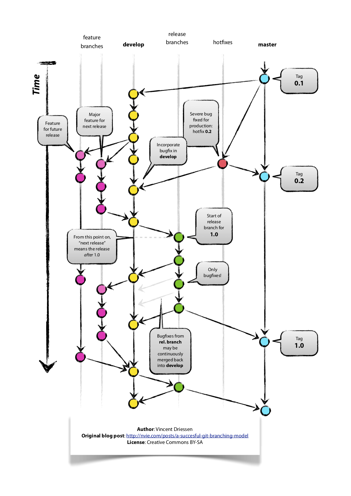
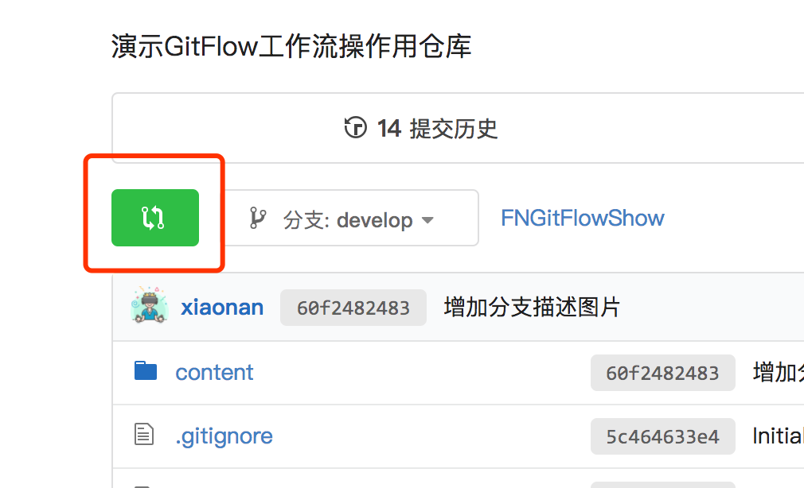

# FNGitFlowShow

演示GitFlow工作流操作用仓库

工作流中涉及到的角色介绍：

+ 功能开发者：模块中功能的开发人员；
+ 开发管理员：由项目模块开发的小组长（team leader）担当；
+ 测试管理员：由测试团队指定人员担当；
+ 发布管理员：由生产环境发布团队指定人员担当；

## Git Flow中的分支

Git Flow模型中定义了主分支和辅助分支两类分支。其中主分支用于组织与软件开发、部署相关的活动；辅助分支组织为了解决特定的问题而进行的各种开发活动。

## 主分支 也可以称为 历史性分支（Historical Branches）

主分支是所有开发活动的核心分支。所有的开发活动产生的输出物最终都会反映到主分支的代码中。主分支分为master分支和develop分支。

## master分支

master分支上存放的应该是随时可供在生产环境中部署的代码（Production Ready state）。当开发活动告一段落，产生了一份新的可供部署的代码时，master分支上的代码会被更新。同时，每一次更新，最好添加对应的版本号标签（TAG）。

## develop分支

develop分支是保存当前最新开发成果的分支。通常这个分支上的代码也是可进行每日夜间发布的代码（Nightly build）。因此这个分支有时也可以被称作“integration branch”。

当develop分支上的代码已实现了软件需求说明书中所有的功能，通过了所有的测试后，并且代码已经足够稳定时，就可以将所有的开发成果合并回master分支了。对于master分支上的新提交的代码建议都打上一个新的版本号标签（TAG），供后续代码跟踪使用。

因此，每次将develop分支上的代码合并回master分支时，我们都可以认为一个新的可供在生产环境中部署的版本就产生了。通常而言，“仅在发布新的可供部署的代码时才更新master分支上的代码”是推荐所有人都遵守的行为准则。基于此，理论上说，每当有代码提交到master分支时，我们可以使用Git Hook触发软件自动测试以及生产环境代码的自动更新工作。这些自动化操作将有利于减少新代码发布之后的一些事务性工作。

只有`开发管理员`有合并的权限

## 辅助分支

辅助分支是用于组织解决特定问题的各种软件开发活动的分支。辅助分支主要用于组织软件新功能的并行开发、简化新功能开发代码的跟踪、辅助完成版本发布工作以及对生产代码的缺陷进行紧急修复工作。这些分支与主分支不同，通常只会在有限的时间范围内存在。

辅助分支包括：

+ 用于开发新功能时所使用的feature分支；
+ 用于集成测试、辅助版本发布的release分支；
+ 用于修正生产代码中的缺陷的hotfix分支。

跟“历史性”分支相反，这三类分支都是短期分支，针对他们的工作内容完成后，一般都要进行删除。

**工作内容完成的标识有两个：开发完成、合并完成，缺一不可。**

## feature分支

使用规范：

+ 从develop分支发起feature分支，从不与master分支、release分支直接交互；
+ 在新开发完的feature推送到远端（origin）仓库后，代码必须合并回develop分支；
+ 由每组`开发管理员`负责把所有feature分支开发完成的代码合并到develop分支；
+ feature分支的命名不可以使用`master`，`develop`，`release-*`，`hotfix-*`；格式必须是`版本号-功能名`，例如`v1.0.0-login`；

feature分支通常是在开发一项新的软件功能的时候使用，这个分支上的代码变更最终合并回develop分支或者干脆被抛弃掉（例如实验性且效果不好的代码变更）。

一般而言，feature分支代码可以保存在开发者自己的代码库中而不强制提交到主代码库里。

## release分支

使用规范：

+ 必须从develop分支派生
+ 必须合并回develop分支和master分支
+ 分支命名惯例：`release-*`

release分支是为发布新的产品版本而设计的。在这个分支上的代码允许做小的缺陷修正、准备发布版本所需的各项说明信息（版本号、发布时间、编译时间等等）。通过在release分支上进行这些工作可以让develop分支空闲出来以接受新的feature分支上的代码提交，进入新的软件开发迭代周期。

当develop分支上的代码已经包含了所有即将发布的版本中所计划包含的软件功能，并且已通过所有测试时，我们就可以考虑准备创建release分支了。而所有在当前即将发布的版本之外的业务需求一定要确保不能混到release分支之内（避免由此引入一些不可控的系统缺陷）。

成功的派生了release分支，并被赋予版本号之后，develop分支就可以为“下一个版本”服务了。所谓的“下一个版本”是在当前即将发布的版本之后发布的版本。版本号的命名可以依据项目定义的版本号命名规则进行。

## hotfix分支

使用规范：

+ 必须从master分支派生
+ 必须合并回master分支和develop分支
+ 分支命名惯例：`hotfix-*`

除了是计划外创建的以外，hotfix分支与release分支十分相似：都可以产生一个新的可供在生产环境部署的软件版本。

当生产环境中的软件遇到了异常情况或者发现了严重到必须立即修复的软件缺陷的时候，就需要从master分支上指定的TAG版本派生hotfix分支来组织代码的紧急修复工作。

这样做的显而易见的好处是不会打断正在进行的develop分支的开发工作，能够让团队中负责新功能开发的人与负责代码紧急修复的人并行的开展工作。

## Pull Request

Pull Request是当`功能开发者`完成一个新功能后向`项目维护者`发送合并请求通知的机制。它的使用过程如下：

1. `功能开发者`可以通过[Web页面](https://source.enncloud.cn)发送pull request
2. `开发管理员`自己或组织其他的团队成员审查、讨论和修改代码
3. `开发管理员`合并新增功能分支到develop分支，然后关闭pull request

### SourceTree mac版本下载地址

SourceTree_2.3.1.zip

链接:https://pan.baidu.com/s/1XHFvLh5MueebYjjGrEVcdQ  密码:opjd

### SourceTree win版本下载地址

SourceTree2480.zip

链接:https://pan.baidu.com/s/1z6UC7LrzJLNn9yeQnxoWyg  密码:7uac

windows下使用sourcetree需要安装一下软件，请在安装sourcetree前安装好：

Git-2.17.0-64-bit.exe

链接:https://pan.baidu.com/s/1q0WQw03U9oCmhN5Fii7PNQ  密码:ab2n

mercurial-4.4.1-x64.msi

链接:https://pan.baidu.com/s/1PBIRFFMPsIe3MoV_42dDzg  密码:nvkx

安装SourceTree打开后会提示你Atlassian需要注册，这家软件公司在澳大利亚，所以注册时需要翻墙，才能注册成功，这里提供一个跳过注册的方法

1. 找到目录：C:\Users\用户\AppData\Local\Atlassian\SourceTree
2. 新建accounts.json文件里面输入
<code>
[  
  {  
    "$id": "1",  
    "$type": "SourceTree.Api.Host.Identity.Model.IdentityAccount, SourceTree.Api.Host.Identity",  
    "Authenticate": true,  
    "HostInstance": {  
      "$id": "2",  
      "$type": "SourceTree.Host.Atlassianaccount.AtlassianAccountInstance, SourceTree.Host.AtlassianAccount",  
      "Host": {  
        "$id": "3",  
        "$type": "SourceTree.Host.Atlassianaccount.AtlassianAccountHost, SourceTree.Host.AtlassianAccount",  
        "Id": "atlassian account"  
      },  
      "BaseUrl": "https://id.atlassian.com/"  
    },  
    "Credentials": {  
      "$id": "4",  
      "$type": "SourceTree.Model.BasicAuthCredentials, SourceTree.Api.Account",  
      "Username": "",  
      "Email": null  
    },  
    "IsDefault": false  
  }  
]
</code>
3. 重新打开，就不会提示注册了！

## FNLogin 分支

临时功能性分支，在此分支下开发新增加的功能

## FNRegister 分支

注册模块功能分支，主要实现注册相关界面及网络请求

## FNForgetPassword

仅仅是测试